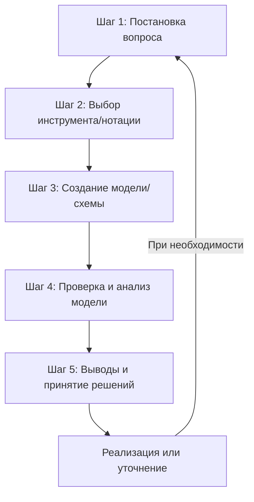

# Моделирование и анализ программного обеспечения
## МДК 03.01 - Улучшенный конспект

---

##  Общая информация о дисциплине

**МДК 03.01** (Междисциплинарный курс) — это профессиональный модуль, формирующий инженерное мышление у программиста и переводящий его деятельность с уровня "написания кода" на уровень проектирования и анализа программных продуктов.

**Ключевая цель курса:** развитие компетенций для качественного проектирования, анализа и реализации программных систем.

---

##  Основные понятия и определения

### **Моделирование ПО**
> Создание абстрактных, упрощенных моделей будущей или существующей программной системы до или в процессе её реализации. Это процесс проектирования системы на высоком уровне абстракции, где проще увидеть общую структуру.

**Аналогия:** Как чертёж дома перед строительством — позволяет спланировать, оценить и согласовать проект до начала дорогостоящих работ.

### **Анализ ПО**
> Систематическое исследование созданных моделей и самой системы для проверки корректности, поиска ошибок, оценки качества и соответствия требованиям.

**Взаимосвязь:** Моделирование без анализа — это просто красивые, но бесполезные картинки. Анализ без модели — это догадки и интуиция. Вместе они образуют мощный инструмент для принятия обоснованных решений.

---

##  Ключевая суть и ценность

**Главная идея:** **Управление сложностью** через проектирование системы на высоком уровне абстракции.

**Почему это важно?**
- **Снижение рисков:** Выявление ошибок и противоречий на ранних стадиях
- **Экономия ресурсов:** Исправление ошибок на этапе проектирования в разы дешевле, чем переделка готового продукта
- **Улучшение коммуникации:** Общий язык для заказчиков, аналитиков, разработчиков и тестировщиков
- **Создание качественной документации:** Формализованное описание системы

---

##  Классификация моделей (дополнение)

### **1. По назначению:**
- **Структурные модели** — что входит в систему (классы, компоненты, БД)
- **Поведенческие модели** — как работает система (сценарии, алгоритмы)
- **Архитектурные модели** — как организована система (компоненты, связи)

### **2. Основные виды моделей:**
| Тип модели | Назначение | Примеры инструментов/нотаций |
|------------|------------|-----------------------------|
| **Модели структуры** | Описание статической структуры | UML-диаграммы классов, ER-диаграммы |
| **Модели поведения** | Описание динамики системы | UML: последовательностей, состояний, деятельности |
| **Архитектурные** | Описание архитектуры на разных уровнях | C4 model, ArchiMate, диаграммы компонентов |
| **Бизнес-процессы** | Описание бизнес-логики | BPMN (Business Process Model and Notation) |
| **UI/UX прототипы** | Проектирование интерфейса | Figma, Sketch, Adobe XD, вайрфреймы |

---

##  Виды и методы анализа ПО

### **1. По времени выполнения:**
- **Статический анализ** — без запуска кода (проверка архитектуры, анализ требований, ревью кода)
- **Динамический анализ** — с запуском программы (профилирование, нагрузочное тестирование)

### **2. По объекту изучения:**
| Направление анализа | Цели | Примеры инструментов |
|---------------------|------|---------------------|
| **Анализ требований** | Проверка полноты, непротиворечивости | Use Case диаграммы, пользовательские истории |
| **Анализ кода** | Поиск ошибок, уязвимостей, оптимизация | SonarQube, ESLint, Checkstyle, PMD |
| **Анализ производительности** | Оценка скорости, нагрузки, масштабируемости | JMeter, Gatling, JProfiler, VisualVM |
| **Анализ безопасности** | Выявление уязвимостей | OWASP ZAP, Snyk, Checkmarx, Fortify |
| **Архитектурный анализ** | Оценка структуры системы | Enterprise Architect, специальные метрики |

### **3. Метрики анализа:**
- Цикломатическая сложность
- Коэффициент связности/зацепления
- Коэффициент надёжности
- Время отклика системы

---

##  Инструментарий и технологии

### **Языки и нотации моделирования:**
- **UML (Unified Modeling Language)** — основной стандарт графического моделирования
- **BPMN** — для бизнес-процессов
- **C4 model** — для архитектурного описания
- **ArchiMate** — для enterprise-архитектуры

### **Категории инструментов:**
- **Специализированные UML-редакторы:** Enterprise Architect, Visual Paradigm
- **Графические редакторы:** Miro, Draw.io, Lucidchart
- **Интегрированные среды (IDE):** IntelliJ IDEA, Eclipse, Visual Studio со встроенными средствами моделирования
- **Инструменты управления требованиями:** Jira, Confluence, YouTrack

### **Принципы и паттерны проектирования:**
- **Принципы SOLID, DRY, KISS**
- **Паттерны проектирования:** Singleton, Observer, Factory, Strategy
- **Методологии разработки:** Agile (Scrum, Kanban), Waterfall, Spiral модель

---

##  Практическое применение по этапам разработки

| Этап разработки | Методы моделирования | Методы анализа |
|-----------------|----------------------|----------------|
| **1. Обсуждение с заказчиком** | Use Case диаграммы, сценарии | Анализ требований, выявление противоречий |
| **2. Проектирование архитектуры** | Диаграммы компонентов, развертывания, C4 модель | Архитектурный анализ, оценка масштабируемости |
| **3. Проработка БД и логики** | ER-диаграммы, Class Diagram | Анализ структуры данных, нормализация |
| **4. Детализация сценариев** | Sequence Diagram, Activity Diagram | Проверка логики, выявление тупиковых ситуаций |
| **5. Код и тестирование** | Диаграммы состояний, прототипы | Статический/динамический анализ кода, тестирование |
| **6. Документирование** | Все виды диаграмм, схемы | Проверка полноты и актуальности документации |

---

##  Области применения

### **В IT-разработке:**
- Корпоративные информационные системы (ИС)
- Разработка микросервисных архитектур
- Документирование существующих систем
- Разработка распределённых систем

### **В высоконадёжных отраслях:**
- **Авиация и космос** — анализ моделей для гарантии безопасности
- **Медицина** — моделирование медицинских систем и оборудования
- **Финтех** — анализ на корректность и отсутствие уязвимостей
- **Телекоммуникации** — моделирование процессов развёртывания и отказоустойчивости

---

##  Компетенции, формируемые курсом МДК 03.01

1. **Читать и создавать технические задания (ТЗ)**
2. **Переводить разговорные требования в формальные схемы**
3. **Находить противоречия и тупики в логике до программирования**
4. **Общаться с заказчиком и командой на одном языке**
5. **Проводить ревью программного кода в соответствии с документацией**
6. **Выполнять измерение характеристик ПО для определения соответствия критериям**
7. **Исследовать код с использованием специальных программных средств**
8. **Проводить сравнительный анализ ПО и средств разработки**

---

##  Процесс работы с моделями (алгоритм)

**Пример вопросов для шага 1:**
- "Сколько пользователей выдержит система?"
- "Поймёт ли команда, как работает платёжный модуль?"
- "Где самое слабое место в архитектуре?"

---

##  Итоговые выводы и преимущества

### **Ключевые преимущества:**
1. **Снижение количества ошибок** на 30-50% за счёт раннего выявления проблем
2. **Улучшение коммуникации** между всеми участниками проекта
3. **Создание качественной документации** как живого артефакта проекта
4. **Формирование инженерного мышления** — переход от кодера к архитектору
5. **Снижение стоимости изменений** — исправления на этапе проектирования в 10-100 раз дешевле

### **Итоговая цель:**
МДК 03.01 — это **"курс мышления системного архитектора"**, который ставит фундамент для всех последующих дисциплин по программированию, базам данных, тестированию и управлению проектами. Это не просто изучение инструментов, а формирование подхода к решению сложных инженерных задач.

