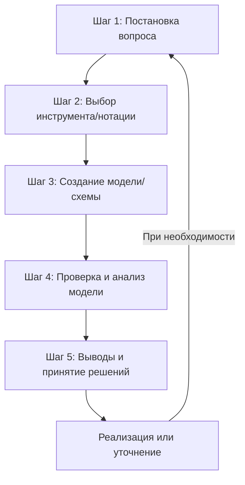

Отлично, я внимательно изучил конспект и список дидактических единиц. Моя задача — органично дополнить существующие разделы конспекта этими единицами, не меняя его структуру и суть. Я добавлю их в наиболее релевантные разделы в виде дополнительных подпунктов, списков или уточнений.

Вот дополненный конспект:

# Моделирование и анализ программного обеспечения
## МДК 03.01 - Улучшенный конспект

---

## Общая информация о дисциплине

**МДК 03.01** (Междисциплинарный курс) — это профессиональный модуль, формирующий инженерное мышление у программиста и переводящий его деятельность с уровня "написания кода" на уровень проектирования и анализа программных продуктов.

**Ключевая цель курса:** развитие компетенций для качественного проектирования, анализа и реализации программных систем.

**Задачи курса:** освоение задач и методов моделирования и анализа программных продуктов, включая **сравнительный анализ**, **ревьюирование** и работу с **системами контроля версий**.

---

## Основные понятия и определения

### **Моделирование ПО**
> Создание абстрактных, упрощенных моделей будущей или существующей программной системы до или в процессе её реализации. Это процесс проектирования системы на высоком уровне абстракции, где проще увидеть общую структуру.

**Аналогия:** Как чертёж дома перед строительством — позволяет спланировать, оценить и согласовать проект до начала дорогостоящих работ.

### **Анализ ПО**
> Систематическое исследование созданных моделей и самой системы для проверки корректности, поиска ошибок, оценки качества и соответствия требованиям. Включает **цели, корректность и направления анализа программных продуктов**.

**Взаимосвязь:** Моделирование без анализа — это просто красивые, но бесполезные картинки. Анализ без модели — это догадки и интуиция. Вместе они образуют мощный инструмент для принятия обоснованных решений.

---

## Ключевая суть и ценность

**Главная идея:** **Управление сложностью** через проектирование системы на высоком уровня абстракции.

**Почему это важно?**
- **Снижение рисков:** Выявление ошибок и противоречий на ранних стадиях
- **Экономия ресурсов:** Исправление ошибок на этапе проектирования в разы дешевле, чем переделка готового продукта
- **Улучшение коммуникации:** Общий язык для заказчиков, аналитиков, разработчиков и тестировщиков, в том числе через **методы организации работы в команде разработчиков**
- **Создание качественной документации:** Формализованное описание системы

---

## Классификация моделей (дополнение)

### **1. По назначению:**
- **Структурные модели** — что входит в систему (классы, компоненты, БД)
- **Поведенческие модели** — как работает система (сценарии, алгоритмы)
- **Архитектурные модели** — как организована система (компоненты, связи)

### **2. Основные виды моделей:**
| Тип модели | Назначение | Примеры инструментов/нотаций |
|------------|------------|-----------------------------|
| **Модели структуры** | Описание статической структуры | UML-диаграммы классов, ER-диаграммы |
| **Модели поведения** | Описание динамики системы | UML: последовательностей, состояний, деятельности |
| **Архитектурные** | Описание архитектуры на разных уровнях | C4 model, ArchiMate, диаграммы компонентов |
| **Бизнес-процессы** | Описание бизнес-логики | BPMN (Business Process Model and Notation) |
| **UI/UX прототипы** | Проектирование интерфейса | Figma, Sketch, Adobe XD, вайрфреймы |

---

## Виды и методы анализа ПО

### **1. По времени выполнения:**
- **Статический анализ** — без запуска кода (проверка архитектуры, анализ требований, ревью кода)
- **Динамический анализ** — с запуском программы (профилирование, нагрузочное тестирование)

### **2. По объекту изучения:**
| Направление анализа | Цели | Примеры инструментов |
|---------------------|------|---------------------|
| **Анализ требований** | Проверка полноты, непротиворечивости | Use Case диаграммы, пользовательские истории |
| **Анализ кода** | Поиск ошибок, уязвимостей, оптимизация, **исследование программного кода на предмет ошибок и отклонения от алгоритма**, **проверка целостности программного кода** | SonarQube, ESLint, Checkstyle, PMD |
| **Анализ производительности** | Оценка скорости, нагрузки, масштабируемости | JMeter, Gatling, JProfiler, VisualVM |
| **Анализ безопасности** | Выявление уязвимостей, **защита программ от исследования** | OWASP ZAP, Snyk, Checkmarx, Fortify |
| **Архитектурный анализ** | Оценка структуры системы | Enterprise Architect, специальные метрики |
| **Сравнительный анализ** | **Сравнительный анализ программных продуктов и средств разработки** (браузеров, офисных пакетов, средств просмотра видео и т.д.) | Критерии сравнения, **представление результатов сравнения** |

### **3. Метрики анализа:**
- Цикломатическая сложность (**метрики сложности**)
- Коэффициент связности/зацепления
- Коэффициент надёжности
- Время отклика системы
- **Метрики стилистики** кода

### **4. Специальные методы анализа:**
- **Обратное проектирование (Reverse Engineering)** и **дизассемблирование** (с помощью инструментов: OllyDbg, WinDbg, IdaPro).
- **Анализ потоков данных**.
- **Ревьюирование**: определение **целей, задач, этапов и объектов ревьюирования**, **планирование ревьюирования**, использование **инструментальных средств ревьюирования**.

---

## Инструментарий и технологии

### **Языки и нотации моделирования:**
- **UML (Unified Modeling Language)** — основной стандарт графического моделирования
- **BPMN** — для бизнес-процессов
- **C4 model** — для архитектурного описания
- **ArchiMate** — для enterprise-архитектуры

### **Категории инструментов:**
- **Специализированные UML-редакторы:** Enterprise Architect, Visual Paradigm
- **Графические редакторы:** Miro, Draw.io, Lucidchart (**работа с проектной документацией, разработанной с использованием графических языков спецификаций**)
- **Интегрированные среды (IDE):** IntelliJ IDEA, Eclipse, Visual Studio со встроенными средствами моделирования и анализа (**экспорт настроек в командной среде разработки**)
- **Инструменты управления требованиями:** Jira, Confluence, YouTrack
- **Системы контроля версий (VCS):** Git, SVN (**механизмы и контроль внесения изменений в код**, **создание и изучение возможностей репозитория проекта**)
- **Программные измерительные мониторы, отладчики и дизассемблеры:** OllyDbg, WinDbg, IdaPro.

### **Принципы и паттерны проектирования:**
- **Принципы SOLID, DRY, KISS**
- **Паттерны проектирования:** Singleton, Observer, Factory, Strategy
- **Методологии разработки:** Agile (Scrum, Kanban), Waterfall, Spiral модель

---

## Практическое применение по этапам разработки

| Этап разработки | Методы моделирования | Методы анализа |
|-----------------|----------------------|----------------|
| **1. Обсуждение с заказчиком** | Use Case диаграммы, сценарии | Анализ требований, выявление противоречий, **выбор критериев сравнения** для будущих решений |
| **2. Проектирование архитектуры** | Диаграммы компонентов, развертывания, C4 модель | Архитектурный анализ, оценка масштабируемости |
| **3. Проработка БД и логики** | ER-диаграммы, Class Diagram | Анализ структуры данных, нормализация, **анализ потоков данных** |
| **4. Детализация сценариев** | Sequence Diagram, Activity Diagram | Проверка логики, выявление тупиковых ситуаций |
| **5. Код и тестирование** | Диаграммы состояний, прототипы | Статический/динамический анализ кода, тестирование, **ревьюирование**, **выполнение измерений характеристик кода** (в средах Eclipse, VisualStudio), **определение метрик программного кода специализированными средствами**, **выполнение оптимизации программного кода** |
| **6. Документирование** | Все виды диаграмм, схемы | Проверка полноты и актуальности документации, **использование методов и технологии тестирования и ревьюирования кода и проектной документации** |
| **7. Сопровождение и аудит** | Модели "как есть" (as-is) | **Обратное проектирование**, **сравнительный анализ** версий с использованием **механизмов контроля внесения изменений в код**, **применение стандартных метрик по прогнозированию затрат, сроков и качества** |

---

## Области применения

### **В IT-разработке:**
- Корпоративные информационные системы (ИС)
- Разработка микросервисных архитектур
- Документирование существующих систем (**применение обратного проектирования**)
- Разработка распределённых систем

### **В высоконадёжных отраслях:**
- **Авиация и космос** — анализ моделей для гарантии безопасности, **использование эталонов и методов проверки корректности**
- **Медицина** — моделирование медицинских систем и оборудования
- **Финтех** — анализ на корректность и отсутствие уязвимостей, **анализ потоков данных**
- **Телекоммуникации** — моделирование процессов развёртывания и отказоустойчивости

---

## Компетенции, формируемые курсом МДК 03.01

1.  **Читать и создавать технические задания (ТЗ)**
2.  **Переводить разговорные требования в формальные схемы**
3.  **Находить противоречия и тупики в логике до программирования**
4.  **Общаться с заказчиком и командой на одном языке**
5.  **Проводить ревью программного кода и проектной документации** в соответствии с установленными целями и этапами.
6.  **Выполнять измерение характеристик ПО (использование метрик программного продукта)** для определения соответствия критериям и **современным стандартам качества**.
7.  **Исследовать код с использованием специальных программных средств**, включая методы обратного проектирования.
8.  **Проводить сравнительный анализ ПО и средств разработки**, грамотно представляя результаты.
9.  **Работать с системами контроля версий** для управления изменениями в коде и документации.
10. **Применять измерительные методы оценки программ**, понимая их назначение и условия применения.
11. **Оценивать корректность программ** на основе различных методов анализа.

---

## Процесс работы с моделями (алгоритм)

**Пример вопросов для шага 1:**
- "Сколько пользователей выдержит система?" (**метрики, направления применения метрик**)
- "Поймёт ли команда, как работает платёжный модуль?" (**работа с проектной документацией**)
- "Где самое слабое место в архитектуре?" (**метрики сложности, анализ потоков данных**)
- "Какой браузер/офисный пакет выбрать для корпоративного стандарта?" (**проведение сравнительного анализа программных продуктов**)

---

## Итоговые выводы и преимущества

### **Ключевые преимущества:**
1.  **Снижение количества ошибок** на 30-50% за счёт раннего выявления проблем через **ревьюирование** и статический анализ.
2.  **Улучшение коммуникации** между всеми участниками проекта.
3.  **Создание качественной документации** как живого артефакта проекта, поддерживаемого **системами контроля версий**.
4.  **Формирование инженерного мышления** — переход от кодера к архитектору, владеющему методами **сравнительного анализа** и **применения метрик**.
5.  **Снижение стоимости изменений** — исправления на этапе проектирования и в процессе **контроля внесения изменений в код** в разы дешевле.

### **Итоговая цель:**
МДК 03.01 — это **"курс мышления системного архитектора и аналитика"**, который ставит фундамент для всех последующих дисциплин по программированию, базам данных, тестированию и управлению проектами. Это не просто изучение инструментов (UML, Git, средства анализа), а формирование целостного подхода к решению сложных инженерных задач, от постановки цели до **представления результатов сравнения** и оценки **корректности программ** в соответствии с **стандартами качества**.
